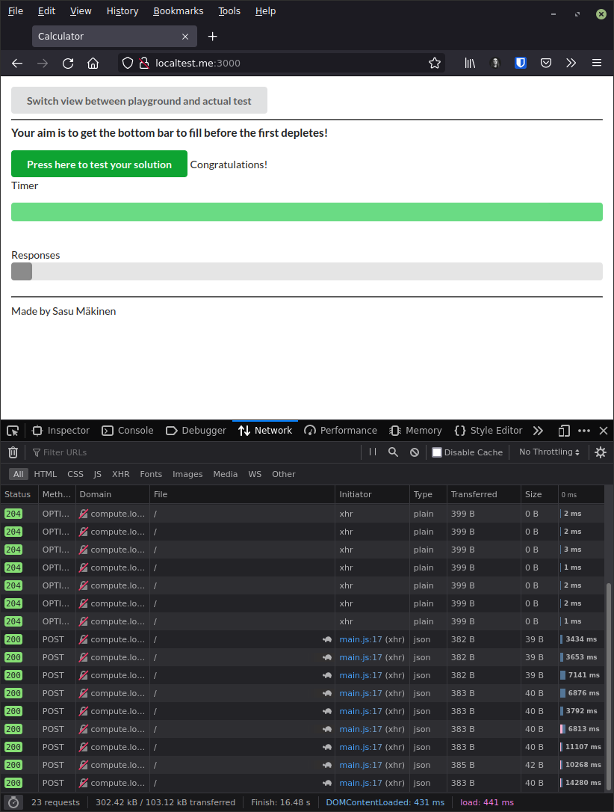

# 2.5

## Running the application

```sh
# If you do not have the scaling-exercise cloned, run
git clone https://github.com/docker-hy/material-applications.git
cd material-applications/scaling-exercise

# Run the application with
docker-compose up -d --scale compute=4
```

## Open browser with address [http://localtest.me:3000](http://localtest.me:3000).


