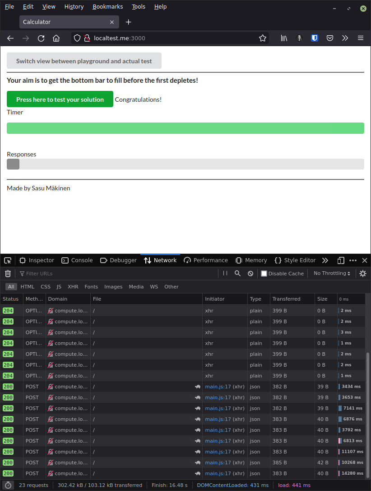

# 2.5

Make it work with command

```sh
> d-c up -d --scale compute=4
```

## Notification

Application worked with Google Chrome Version (92.0.4515.107 (Official Build) (64-bit)), but CORS errors appeared with Firefox.

Solution: Open the website with [http://localtest.me:3000](http://localtest.me:3000).


